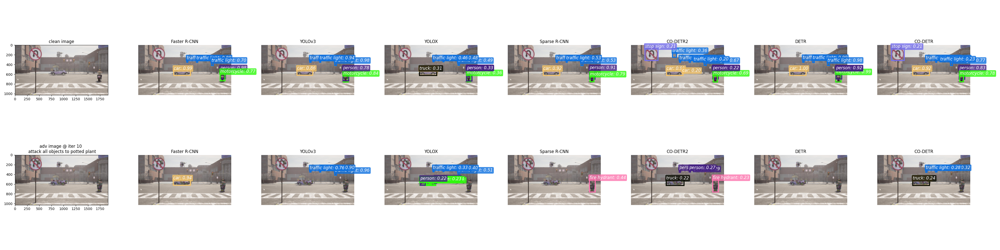
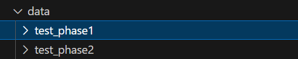

# Ensemble-based Blackbox Attacks on Dense Prediction using Patch

This repo is for the [Adversarial Attack Competition of CVPR workshop 2024](https://challenge.aisafety.org.cn/#/competitionDetail?id=13).

## Attack multiple blackbox models

Below we generate perturbation to attack objects, such as car, person, stop sign and etc.



## Environment

* clone repo  

```shell
git clone --recursive git@github.com:marioyyds/myEBAD.git
```

* python==3.8
* [mmdetection v3.3.0](https://github.com/open-mmlab/mmdetection/tree/v3.3.0)

```shell
# case 1 (recommended)
cd mmdetection
pip install -v -e .

# case 2
pip install -U openmim
mim install mmengine
mim install "mmcv>=2.0.0"
mim install mmdet==3.3.0
```

* pip install -r requirements.txt

## Datasets

Place your datasets to `data` folder as following.
  

## Perform attacks

1. run ```python mmdet_model_info.py``` to download pre-trained models from MMCV.

2. run ```python attack_ensemble_patch.py``` to perform attacks.
