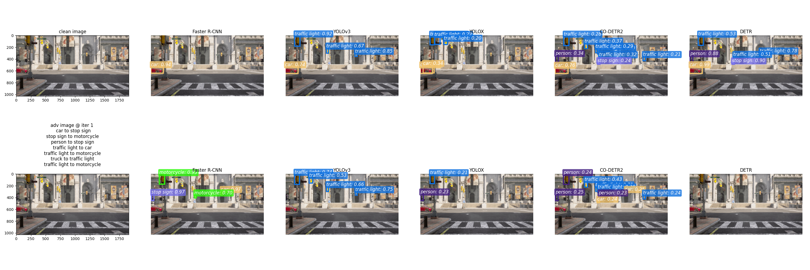

# Ensemble-based Blackbox Attacks on Dense Prediction

This repo is referred to the [paper](https://arxiv.org/abs/2303.14304) and [code](https://github.com/CSIPlab/EBAD). And compared with original code, it has upgrade the mmdetection version to ***v3.3.0***, which means it will support more models to attack.

## Attack multiple blackbox models (detection) using a single perturbation

Below we generate perturbation to attack objects, such as car, person, stop sign and etc.



## Environment

* python==3.8
* [mmdetection v3.3.0](https://github.com/open-mmlab/mmdetection/tree/v3.3.0)
* pip install -r requirements.txt

## Datasets

Object detection: get VOC and COCO datasets under `/data` folder.

```shell
cd data
bash get_voc.sh
bash get_coco.sh
```

## Perform attacks

### Object detection

1. Download and place `mmdetection` folder under EBAD directory.

2. run ```python mmdet_model_info.py``` to download pre-trained models from MMCV.

3. run ```python attack_bb_det.py``` to perform attacks on object detection.

## Acknowledgement

We thank the models support from [MMCV](https://github.com/open-mmlab/mmcv).   
```shell
@InProceedings{Cai_2023_CVPR,
    author    = {Cai, Zikui and Tan, Yaoteng and Asif, M. Salman},
    title     = {Ensemble-Based Blackbox Attacks on Dense Prediction},
    booktitle = {Proceedings of the IEEE/CVF Conference on Computer Vision and Pattern Recognition (CVPR)},
    month     = {June},
    year      = {2023},
    pages     = {4045-4055}
}
```